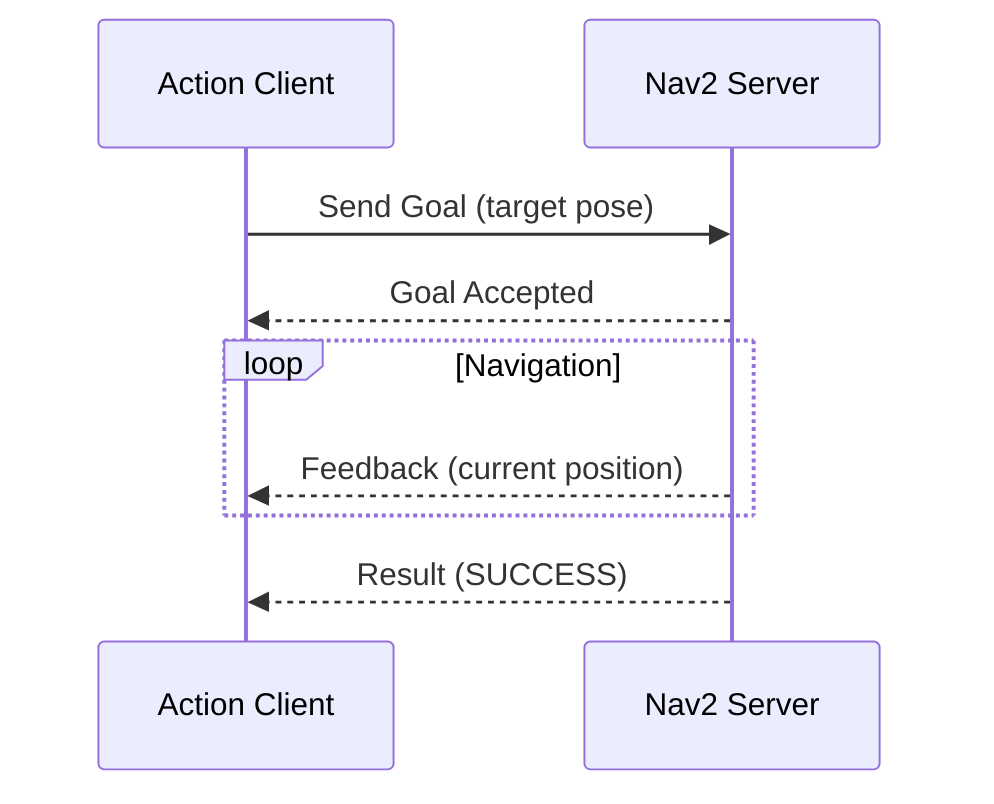

# Technical Diagram Generator

**Command**: `/diagram.generate`
**Type**: Custom Subagent
**Purpose**: Generate SVG/Mermaid diagrams for technical textbook content

## Description

This command spawns a specialized diagram generation subagent that creates clean, educational diagrams for robotics concepts, architectures, and workflows.

## Usage

```bash
/diagram.generate <diagram_type> <concept> [output_path]
```

**Examples:**
```bash
/diagram.generate architecture "ROS 2 DDS Communication" docs/chapter-2-ros2/assets/dds-arch.svg
/diagram.generate flowchart "VSLAM Pipeline" docs/chapter-4-isaac/assets/vslam-pipeline.svg
/diagram.generate sequence "Nav2 Action Call" docs/chapter-2-ros2/assets/nav2-sequence.mermaid
```

## Diagram Types Supported

### 1. Architecture Diagrams
```
ROS 2 Node Architecture
Isaac ROS Pipeline
VLA System Architecture
```

### 2. Flowcharts
```
Algorithm workflows
State machines
Decision trees
```

### 3. Sequence Diagrams
```
ROS 2 service calls
Action server interactions
Message passing flows
```

### 4. Component Diagrams
```
Robot sensor layout
Software module relationships
Hardware connections
```

### 5. Data Flow Diagrams
```
Perception pipelines
Control loops
Data processing chains
```

## Output Formats

### SVG (Recommended for Textbooks)
- Scalable vector graphics
- Clean lines and text
- Docusaurus-compatible
- Accessible (can add alt text)

### Mermaid (For Simple Diagrams)
- Text-based diagram markup
- Renders in Docusaurus automatically
- Version-control friendly
- Easy to edit

## Style Guidelines

The generator follows these design principles:

1. **Educational Clarity**
   - Large, readable fonts (min 14px)
   - High contrast colors
   - Clear labels and legends
   - Consistent styling

2. **Technical Accuracy**
   - Accurate component relationships
   - Proper terminology
   - Correct data flow directions

3. **Accessibility**
   - Alt text included
   - Color-blind friendly palette
   - Text-based fallbacks

4. **Consistency**
   - Unified color scheme across chapter
   - Standard shapes for concepts (e.g., nodes = circles, topics = rectangles)
   - Consistent spacing and alignment

## Example Output

### Architecture Diagram (SVG)
```xml
<?xml version="1.0" encoding="UTF-8"?>
<svg xmlns="http://www.w3.org/2000/svg" viewBox="0 0 800 600">
  <!-- ROS 2 Publisher-Subscriber Architecture -->
  <rect x="100" y="100" width="200" height="100" fill="#4A90E2" stroke="#000" stroke-width="2"/>
  <text x="200" y="155" text-anchor="middle" font-size="16" fill="#FFF">Publisher Node</text>

  <rect x="500" y="100" width="200" height="100" fill="#50E3C2" stroke="#000" stroke-width="2"/>
  <text x="600" y="155" text-anchor="middle" font-size="16" fill="#000">Subscriber Node</text>

  <path d="M 300 150 L 500 150" stroke="#000" stroke-width="3" marker-end="url(#arrowhead)"/>
  <text x="400" y="140" text-anchor="middle" font-size="14">/topic_name</text>
</svg>
```

### Sequence Diagram (Mermaid)


## Diagram Templates

Pre-defined templates for common robotics concepts:

- `ros2_pubsub.template.svg` - Publisher/Subscriber pattern
- `ros2_action.template.mermaid` - Action server/client
- `tf_tree.template.svg` - Transform tree
- `nav2_pipeline.template.svg` - Navigation stack
- `perception_flow.template.svg` - Sensor → Processing → Output
- `vla_architecture.template.svg` - Voice → LLM → Action

## Integration with Chapters

### Automatic Placement
```bash
# Generate and auto-reference in markdown
/diagram.generate architecture "Isaac ROS cuVSLAM" chapter-4-isaac

# Output:
# - Creates: docs/chapter-4-isaac/assets/cuvslam-architecture.svg
# - Returns markdown: 
```

### Manual Insertion
```markdown
## Isaac ROS Architecture

The following diagram shows the cuVSLAM pipeline:


**Key Components:**
- Camera Input → cuVSLAM Node → Odometry Output
```

## Quality Checklist

Before finalizing a diagram:

- [ ] All components labeled clearly
- [ ] Data flow direction indicated with arrows
- [ ] Legend provided if multiple symbols used
- [ ] Appropriate level of detail (not too complex)
- [ ] Colors have semantic meaning
- [ ] File size <200KB for performance
- [ ] Alt text describes diagram purpose

## Success Criteria

- ✅ Diagram accurately represents concept
- ✅ Educational value (helps student understanding)
- ✅ Consistent with textbook style guide
- ✅ Renders correctly in Docusaurus
- ✅ Accessible (alt text, high contrast)

## Notes

- Diagrams should complement, not replace, written explanations
- Use diagrams for spatial/flow concepts, not lists
- Keep diagrams simple - complex concepts need multiple simpler diagrams
- Update diagrams when text changes to maintain consistency
